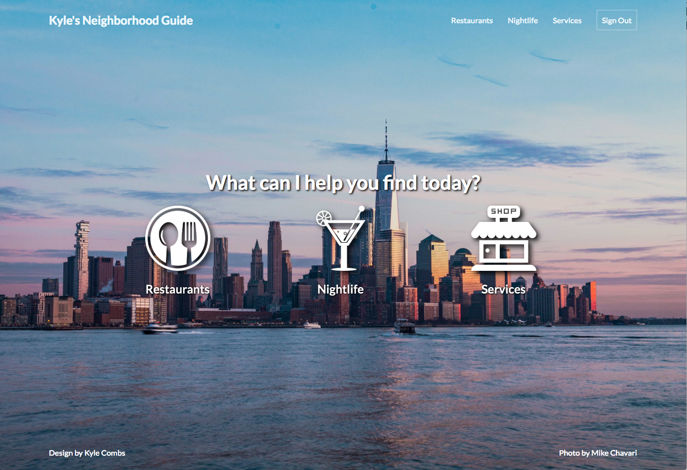
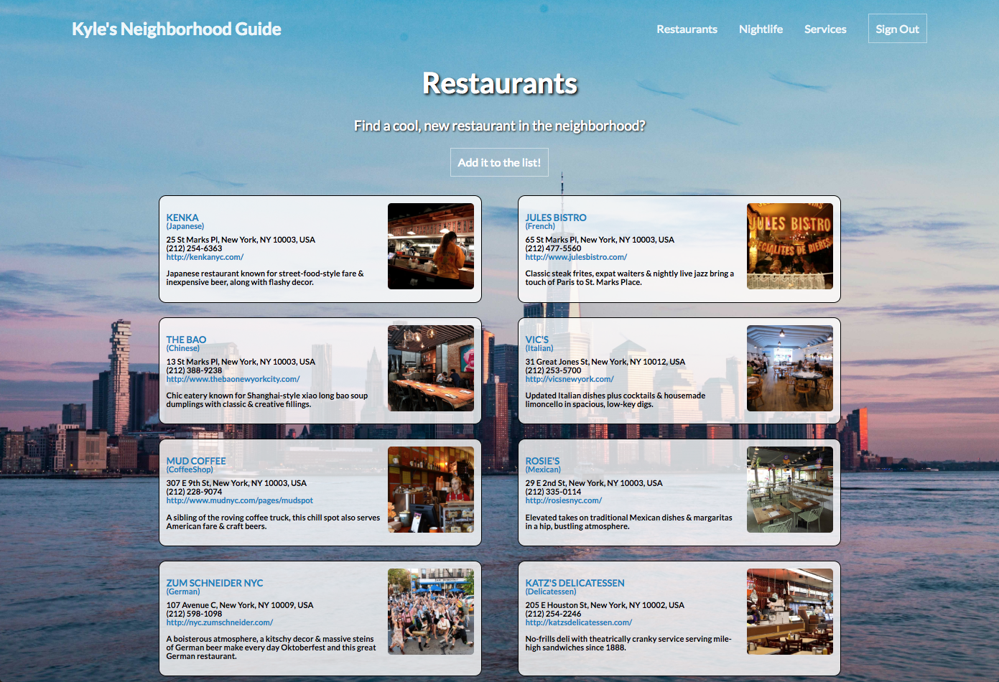
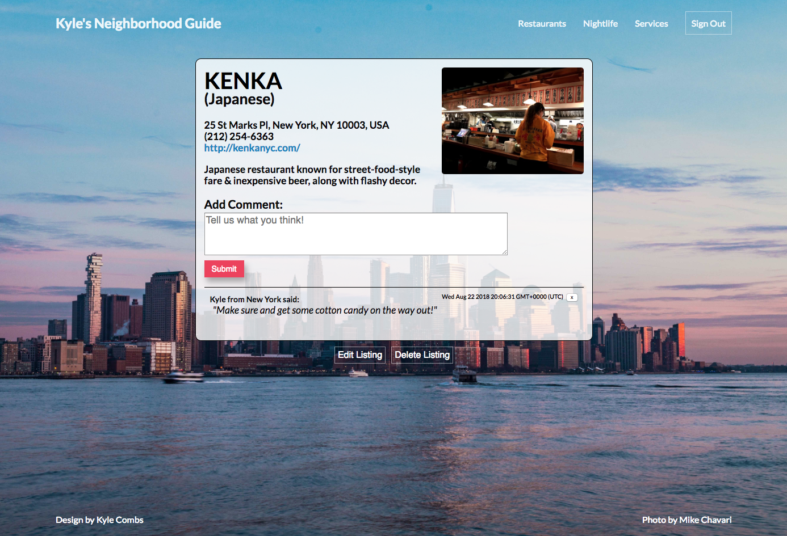
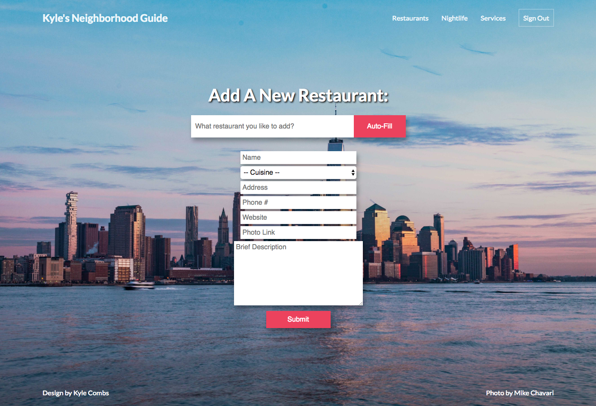
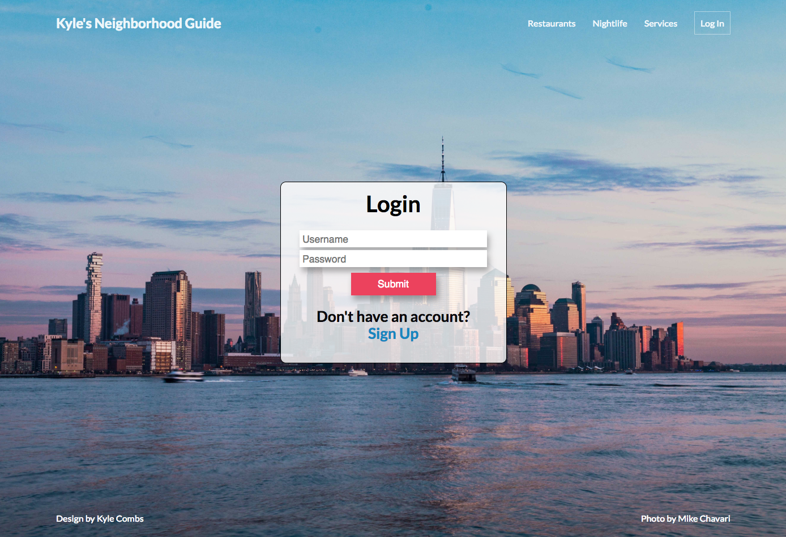
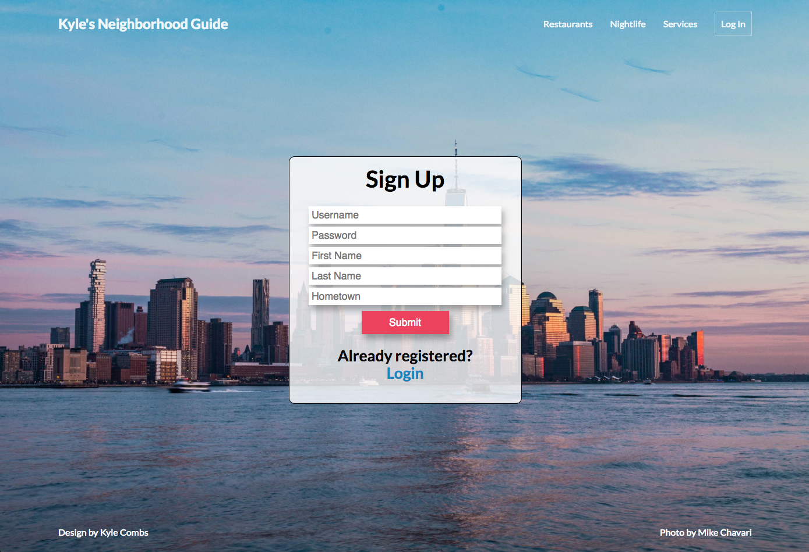

# Neighborhood-Guide
Neighborhood Guide is an interactive guidebook for guests of my short-term rental apartment to help them find cool and interesting places to go in the neighborhood.

Check out the [live version here](https://hidden-oasis-51430.herokuapp.com/).

## Motivation

I run a short-term rental property in NYC.  I wanted to create something a little more interactive and updatable for my guests than just a simple piece of paper with recommendations for them to check out.

## Screenshots
Landing Page:

All Restaurants View:

Single Restaurant View:

Add New Listing View:

Log In Page:

Sign Up / Register Page:

## API's Used
* GoogleMaps Places API

## Technology Used
* HTML / CSS
* NodeJS
* Express
* Mongoose
* Javascript
* MongoDB
* Morgan
* Method-Override
* Passport
* Flash Messaging
* bcryptjs
* Chai
* Mocha
* Faker

## Features

* Users can see all listings recommended without having to create an account
* A User who signs up for an account can:
	* Add listings
	* Add comments to existing listings
	* Edit or Delete any listing or comment they created 

## Access and Live Demo

- [Live Demo](https://hidden-oasis-51430.herokuapp.com/)

### Test User Login/Pass

* Login: spongebob
* Password: squarepants

